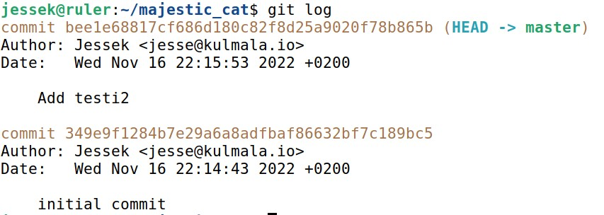
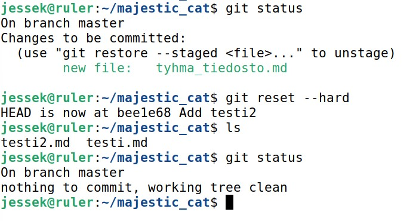
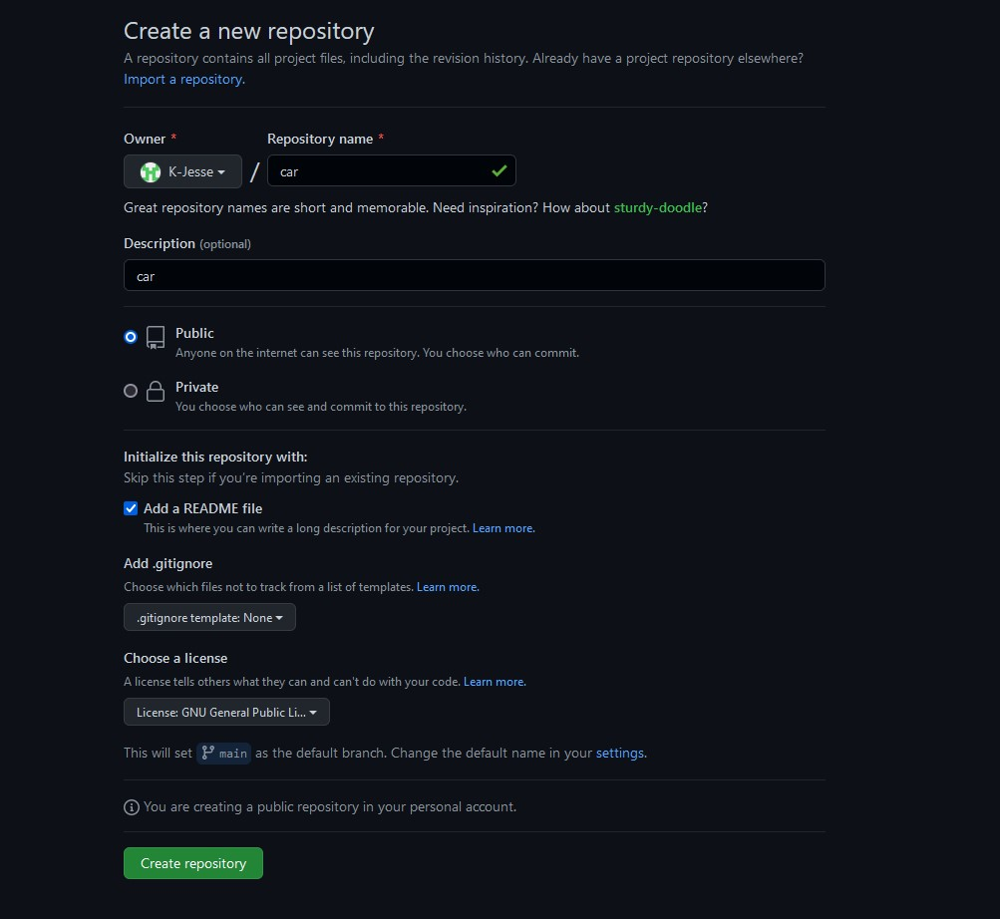
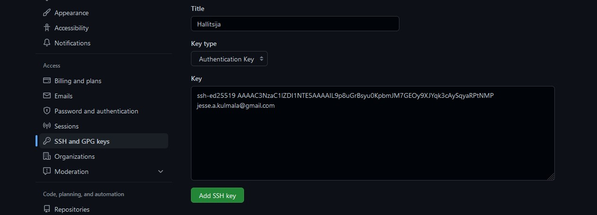
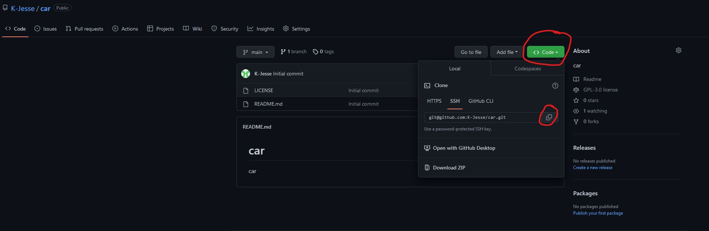
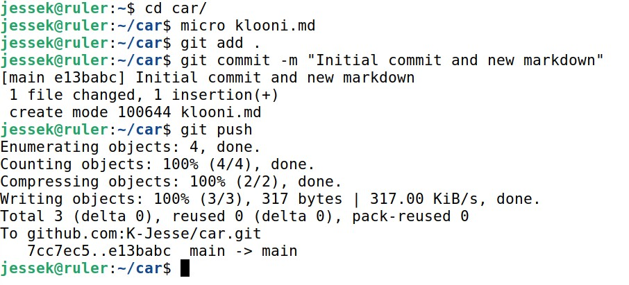
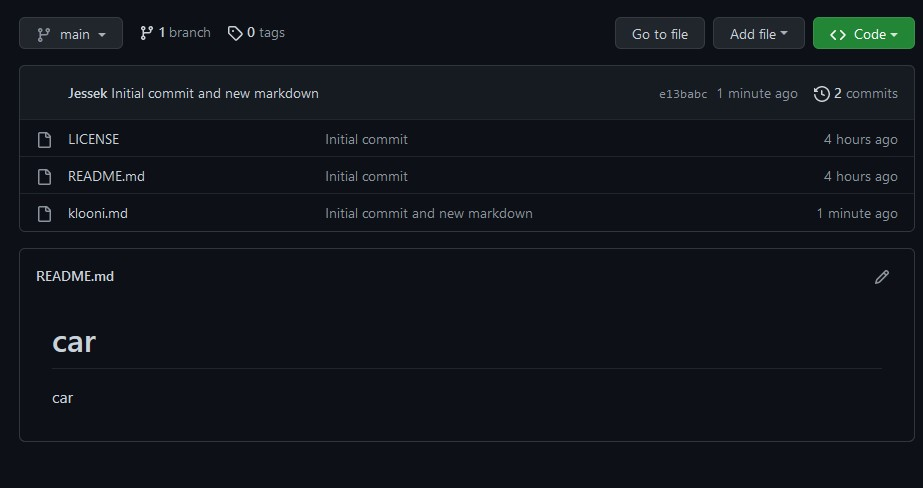

# H3

### A. MarkDown. Tee tämän tehtävän raportti MarkDownina. Helpointa on tehdä raportti GitHub-varastoon, jolloin md-päätteiset tiedostot muotoillaan automaattisesti. Tyhjä rivi tekee kappalejaon, risuaita ‘#’ tekee otsikon, sisennys merkitsee koodinpätkän.

### B. Offline. Tee paikallinen offline-varasto git:llä. Varaston nimessä tulee olla sana "cat" (kissa). Aiemmin tehty varasto ei siis kelpaa. Aseta itsellesi sähköpostiosoite ja nimi. Näytä varastollasi muutosten teko ja niiden katsominen lokista.

Aloitetaan asentamalla git seuraavilla komennoilla. `$ sudo apt-get update` `$ sudo apt-get install -y git` Seuraavaksi tehdään uusi git repositorio komennolla. `$ git init majestic_cat` Tämä loi minulle uuden majestic_cat nimisen repositorion. 

Siirrytään meidän juuri luotuun repositorioon. `$ cd majestic_cat/` 

Seuraavaksi siirrytään sähköpostin ja nimen asettamiseen. Se onnistuu seuraavila komnennoilla. `$ git config --global user.name "Jessek"` `$ git config --global user.email "jesse@kulmala.io"` Tehdään myös muutos meidän repositorioon luomalla uusi MarkDown tiedosto. `$ micro testi.md` Viela pitää lisätä muutos ja commitaa siihen. `$ git add .` `$ git commit -m "initial commit"`

Katsotaan vielä muutoksia lokista komennolla. `$ git log`

### C. Doh! Tee tyhmä muutos gittiin, älä tee commit:tia. Tuhoa huonot muutokset ‘git reset --hard’. Huomaa, että tässä toiminnossa ei ole peruutusnappia.

Tehdään aluksi jokin virhe. `$ micro tyhma_tiedosto.md` Lisätään se vielä. `$ git add .` 

Voi ei! Käytetään resettiä korjaamaan virhe. `$ git reset --hard` Katsotaan vielä, että tilanne on korjattu. `$ git status`

### D. Online. Tee uusi varasto GitHubiin (tai Gitlabiin tai mihin vain vastaavaan palveluun). Varaston nimessä ja lyhyessä kuvauksessa tulee olla sana "car" (auto). Aiemmin tehty varasto ei kelpaa. (Muista tehdä varastoon tiedostoja luomisvaiheessa, suosittelen tekemään README.md ja vapaista lisensseistä itse tykkään GPLv3 eli GNU General Public License, version 3)

Aloitetaan kirjautumalla GitHubiin (tai luomalla uusi tili) ja kirjaudutaan sisään. Seuraavaksi vasemmasta ylänurkasta löytyy vihreä *new* painike. Tästä päästään luomaan uusi repositorio seuraavasta kuvasta näkyy minun luoma repo. Kun asetuksen on laitettu painetaan *Create repository*. Onneksi olkoon! Sinulla on nyt uusi repositorio.

### E. Dolly. Kloonaa edellisessä kohdassa tehty varasto itsellesi, tee muutoksia, puske ne palvelimelle, ja näytä, että ne ilmestyvät weppiliittymään.

Aluksi meidän pitää luoda uusi ssh avainpari ja laittaa se meidän GitHub tilin asetuksiin, että pääsemme käsiksi repositorioihin. `$ ssh-keygen -t ed25519 -C "your_email@example.com"` Mennään tiedostoon joka on .pub päätteinen ja haetaan sieltä avain GitHubiin. `$ cat /home/jessek/.ssh/id_ed25519.pub`

Nyt meidän pitäisi päästä käsiksi repoon. Menään sinne selaimella ja oikeassa ylänurkasta löytyy code painike. Sieltä saamme komennon cloonaukseen.

Ajetaan komento jolla saadaan kloonailtua. `$ git clone git@github.com:K-Jesse/car.git` Nyt voin mennä tiedostoon ja tehdä muutoksia sinne. Lisään vaikka tiedoston esimerkiksi. Seuraavaksi päivitellään muutokset palvelimelle. `$ git add .` `$ git commit -m "Initial commit and new markdown"` `$ git push` Lopuksi varmistetaan vielä, että kaikki toimii oikeasti.

### Lähteet

Karvinen, Tero: Oppitunnit kurssilla Configuration Management Systems - Palvelinten Hallinta.
[Generating a new SSH key and adding it to the ssh-agent](https://docs.github.com/en/authentication/connecting-to-github-with-ssh/generating-a-new-ssh-key-and-adding-it-to-the-ssh-agent)
[Git Bash Commands](https://dev.classmethod.jp/articles/git-bash-commands/)
[MarkDown Guide: Basic syntax](https://www.markdownguide.org/basic-syntax/)
