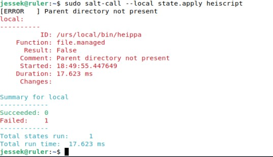
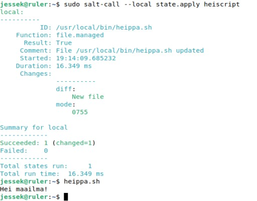

# h4 Omat komennot

## A. Hei komento! Tee järjestelmään uusi "hei maailma" -komento ja asenna se orjille Saltilla. Liitä raporttiisi orjan 'ls -l /usr/local/bin/' tulosteesta ainakin se rivi, jolla näkyy uuden komentotiedostosi oikeudet.

Aloitetaan luomalla kansio meidän uusille kehitteillä oleville scripteille. 
	
	mkdir scripts
	
Luodaan sinne uusi scripti.
	
	micro scripts/heippa.sh
	
	#! /usr/bin/bash

	echo "Hei maailma!"
	
Nyt scripti toimii vain kyseisessä kansiossa ajettuna komennolla:

	bash heippa.sh
	
Annetaan tähän tiedostoon vielä käyttäjille oikeuksia seuraavanlaisesti.

	chmod ugo+x heippa.sh
	
ja kopioidaan scripti saltille jotta se saadaan asennettua orjille.

	sudo cp scripts/heippa.sh /srv/salt/heiscript/
	
EDIT: Tässä välissä kannatte ensin varmistaa, että scripti toimii koko systeeemissä. Eli kopioidaan se /urs/local/bin kansioon ja ajetaan se. Olisi myös hyvä pystyä salt komentoa varten selvittämään tiedoston numeraaliset oikeudet mode asetusta varten, mutta en nyt muista/löydä miten sen sai selville joten menen ulkomuistin varassa, että oikeat oikeudet oli 0755. Se oli jonkin stat komento muistaakseni, palaan tähän mikäli selviää.

	sudo cp scripts/heippa.sh /usr/local/bin/
	
	heippa.sh

Luodaan vielä init.sls tiedosto salttiin mikä ohjeistaa asentamaan kyseisen scriptin.

	/usr/local/bin/heippa.sh:
	  file.managed:
        - source: salt://heiscript/heippa.sh
        - mode: '0755'

Poistetaan scripti ja yritetään asentaa se saltilla, jotta selviää toimiiko salt komento.

	sudo rm /usr/local/bin/heippa.sh
	
	sudo salt-call --local state.apply heiscript

Hmmm... Tarjoaa jotain erroria, katsotaan missä vika.

Vika löytyi ja se oli init.sls tiedostossa ollut kirjoitusvirhe. Korjasin sen esimerkki komennoista pois, mutta virhe on yhä nähtävissä kuvassa. Nyt salt komento toimii oikein.

## B. whatsup.sh. Tee järjestelmään uusi komento, joka kertoo ajankohtaisia tietoja; asenna se orjille. Vinkkejä: Voit näyttää valintasi mukaan esimerkiksi päivämäärää, säätä, tietoja koneesta, verkon tilanteesta...

## C. hello.py. Tee järjestelmään uusi komento Pythonilla ja asenna se orjille. Vinkkejä: Hei maailma riittää, mutta propellihatut saavat toki koodaillakin. Shebang on "#!/usr/bin/python3". Helpoin Python-komento on: print("Hei Tero!")

## D. Laiskaa skriptailua. Tee kansio, josta jokainen skripti kopioituu orjille.

## E. Intel. Etsi kolme loppuprojektia joltain vanhalta kurssitoteutukselta. Kuvaile projektit tiiviisti, viittaa ja linkitä alkuperäiseeen raporttin. Tässä alakohdassa ei tarvitse vielä kokeilla mitään koneella, vaan voit kuvailla niitä oheismateriaalin perusteella.

## F. Lukua, ei luottamusta. Kokeile yhtä kohdassa d-Intel löytämääsi modulia koneella. Tämä on infraa koodina, joten luottamusta ei tarvita. Voit lukea koodista, mitä olet ajamassa.