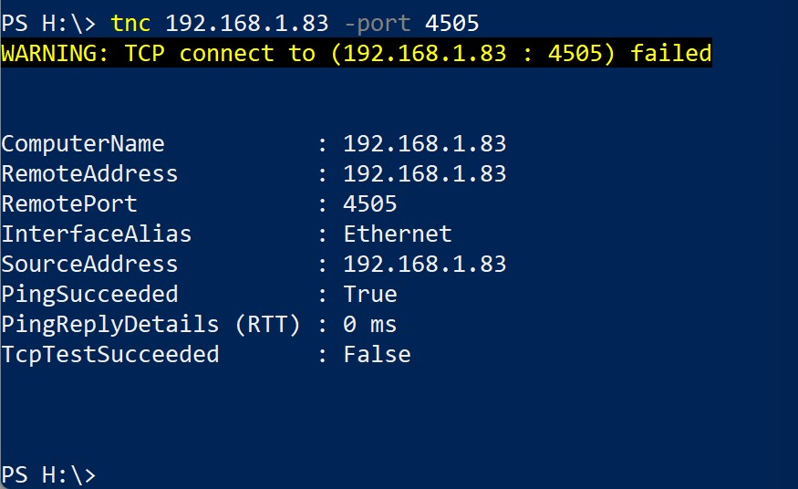

# h5 Windows

Tässä raportissa vastataan Tero Karvisen kurssilla Configuration Management Systems – Palvelinten Hallinta esitettyihin kysymyksiin.

## A. Hello Window Salt! Tee Windowsille SLS-tiedostoon Salt-tila, joka tekee tiedoston nimeltä "suolaikkuna.txt".

Asennetaan salt, joka onnistuus [täältä](https://repo.saltproject.io/). Tämän tein jo edellisellä oppitunnilla. Aloitan luomalla H asemalleni srv ja salt kanstiot sillä tätä kansiorakennetta olen tottunut käyttämään. Tämän teen graafisella käyttöliittymällä ja klikkaamlla hiiren oikeata --> new folder. Luon vielä tilalle oman kansion ja init.sls tiedoston sinne.

	H:\temp\suolaikkuna.txt:
	  file.managed:
	    - contents: "Moi"

Luodaan myös temp kansio mihin voidaan tilalla luoda tämä toivottu tekstitiedosto. 

## B. Ei vihkoa, ei kynää. Kerää Windows-koneen tekniset tiedot tekstitiedostoon. Vapaaehtoinen bonus: Saatko tiedot tallennettua myös json-muodossa?

Tämä tehtävä onnistuu grains.item komennolla. sen voi vielä ohjata oikeaan kansioon käyttämällää ´>´ merkkiä. Tämä seuraava komento syötetään powershelliin ja saadaan haluttu tekstitiedosto. Tämä voidaan sitten vaikka lukea cat:lla. Windowsissa ei tainnut olla lessiä tai sitten se oli jollain toisella nimellä.

## C. Kop kop. Onko TCP-portti auki vai kiinni? Näytä esimerkit portin kokeilusta Linuxilla ja Windowsilla. Näytä kummallakin käyttöjärjestelmällä ainakin yksi avoin ja yksi suljettu portti. (Kokeile tätä vain omaan koneeseesi. Vieraiden koneiden ja verkkojen porttiskannaaminen on kiellettyä. Yksittäisen portin testaavat komennot ovat suositeltavia, esim. nc, tnc)

Aloitetaan linuxista ja siellä asennetaan ensiksi netcat.

	sudo apt-get install netcat

Tämän jälkeen piti hieman hakea tukea tunnilla otetuista kuvista ja selvittää hostin osoite. Se onnistui komennolla `hostname -i`. Tämän jälkeen kokeilin scannata portteja 4505 ja 4506 koska ne portit pitäisi olla auki salttia varten.

	jessek@ruler:~$ hostname -i
	127.0.1.1
	jessek@ruler:~$ nc -vz 127.0.1.1 4506
	Connection to 127.0.1.1 4506 port [tcp/*] succeeded!
	jessek@ruler:~$ nc -vz 127.0.1.1 4505
	Connection to 127.0.1.1 4505 port [tcp/*] succeeded!
	jessek@ruler:~$ 

Windowsin puolella tnc toimii hyvin samalla tyylillä. Haetaan oman koneen osoite jälleen `Get-NetIPAddress` ja käytetään sitä tnc komenossa. Koitetaan taas samaa saltin porttia. 

Portti ei ollut auki mikä varmaankin johtunee siitä, että windows koneelle on vain asennettu salt orja ohjelma jolloin portin ei tarvitse olla auki?

## Lähteet

Karvinen, Tero: Oppitunnit kurssilla Configuration Management Systems - Palvelinten Hallinta.

[Tero Karvisen kotisivut](https://terokarvinen.com/)

[How to verify connectivity using PowerShell ](https://kb.parallels.com/en/124644)

